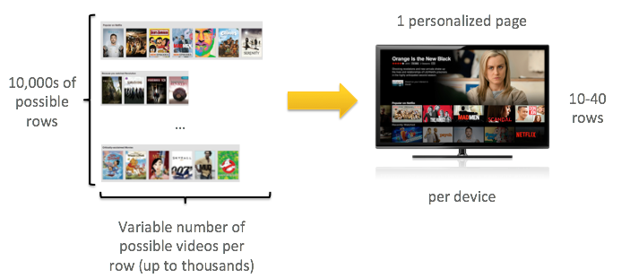
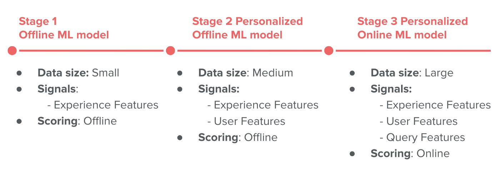
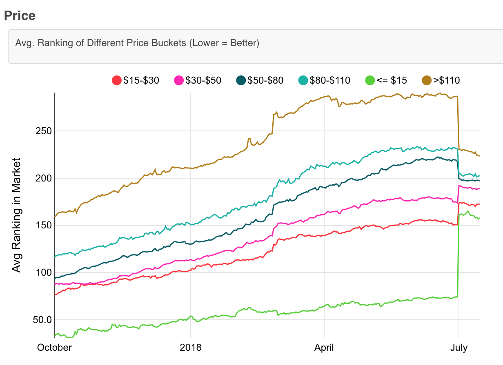
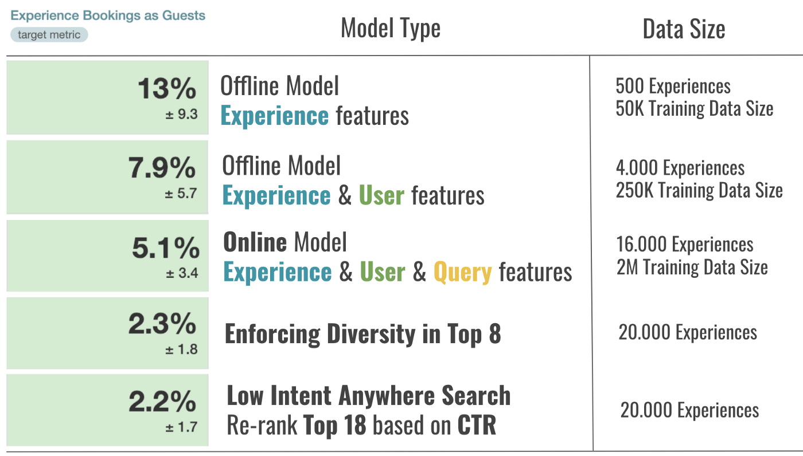
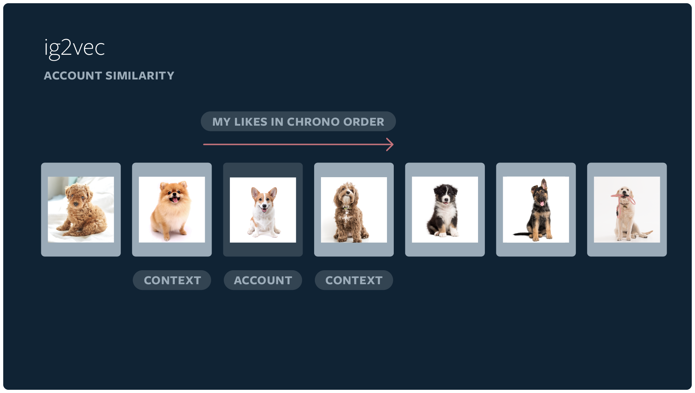
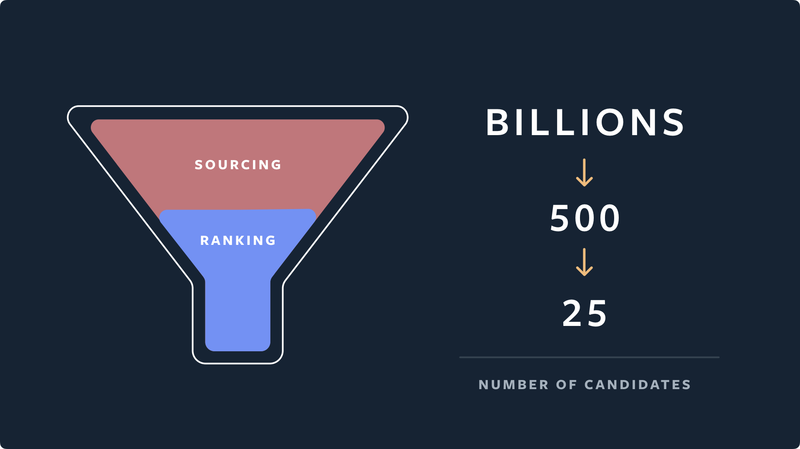

# 学習ベース推薦システムの活用事例

推薦システムを構築することになったので下調べを兼ねた活用事例を調べてみた。やっぱネトフリって神だわ。

## 推薦システムの種類
- パーソナライズあり / なし
  - パーソナライズする場合、ユーザープロフィール・アイテムジャンルのコンテンツ情報と、ユーザーの行動履歴の2種類のデータを主に使用する
- 最初はユーザープロフィールからの推薦、データがたまると行動履歴からの推薦
  - 後者の方が嗜好が反映されやすい傾向

## 人気ランキング・新着順
### 利点
- 実装コストの低さに対し、効果が高い
- アイテムの入れ替わりが激しい場合に有効
### 欠点
- アイテムの流動性が無い場合は、同じようなアイテムが表示されてしまう
  →その場合は、急上昇ランキングなどで対応する？
### 業種
- ほぼ全てのサービス

## 閲覧（購買）履歴の表示
### 利点
- 実装コストの低さに対し、効果が高い
- 一度閲覧（購買）したものを再度閲覧（購買）することが多い場合に有効
### 欠点
- 購買頻度が低いもの（家電等）ではあまり意味がない
- 消耗品などは適切なタイミングで表示しないと効果が薄い
### 業種
- 動画、音楽サイト

## 類似アイテムの表示
### 利点
- ユーザーの回遊を増加させ、欲しいアイテムに出会いやすくさせる
- アイテムの説明文・カテゴリ情報などのコンテンツ情報＋ユーザーの行動履歴をもとに、コンテンツの類似度を計算する
  - 前者の情報より後者の情報を用いた方が、アイテムの雰囲気やコンセプトを捉えやすい
### 欠点
- 1個あれば十分な商品の場合、購買後の表示はあまり意味がない
- クリック率のみに焦点を置くと、面白い商品や珍しい商品など、購買につながらないノイジーな履歴を増やしてしまう場合がある
### 業種
- ECサイト

## ユーザーへ直接推薦
- ユーザーの行動履歴やプロフィールから推薦する
- 最後に見た/購入したアイテムと類似したアイテムを表示する場合が多い
  - 上の類似アイテムの表示のシステムが使用できる

# 他社の事例
## Netflix
- 視聴される作品は、80%以上が推薦経由
- 元々はオンラインDVDレンタル会社

### 推薦システムの工夫
#### 使う情報
- コンテンツ情報→ユーザーの行動情報→ユーザーの評価（5段階）→ユーザーの評価（2段階）
  - コンテンツ情報（ジャンル・出演者・監督等）
  
    ＋ 実装は楽だった

    ー 推薦に納得感が無い（妥当ではなかった）

  - ユーザーの行動情報（ユーザーがどの作品とどの作品をレンタルしたか）

    ＋ コンテンツ情報より良い性能

    ー 実際の推薦の良さが把握できない

    - 「借りたがハズレ」だった時に対応できない
  - ユーザーの評価（5段階）

    ＋ 作品の好みを反映した推薦ができる

    ー （ユーザーの評価方法には個人の偏りがある）

    ー （システムに落とし込みにくい・回帰で解く？）

  - ユーザーの評価（2段階）

    ＋ 作品の好みを反映した推薦

    ＋ 「XX%で気に入る」と表示しやすい

    ＋ システムに落とし込みやすい
#### コールドスタート問題
- 人気ランキングの使用→会員登録時に好きな作品を複数選択する＋しなかった場合は人気ランキングの使用

#### 表示方法
- 行方向に推薦の枠組み（新着、ジャンル、人気作等）、列方向に推薦の順位で表示
  - ユーザーが作品を探索しやすくなる
    - 縦方向のスクロールで興味のあるジャンルを探し、横方向のスクロールで興味のある作品を見つける
- 以前見た作品や既に付けた評価により、推薦内容をフィルタリングする

### その他
#### トレンド
1. Deep Learning
2. Causality
3. Bandits & Reinforcement Learning
4. Fairness
5. Experience personalization
#### Deep Learning
- 2017年くらいから推薦システムでも普及
- 従来は協調フィルタリングや、行列分解（MF）
- Userの情報とアイテムの行列をDeepに入れるだけでは常にはうまくいかないが、上手くやれば精度が上がる
  - ユーザーの行動履歴（遷移情報）を使う
  - 大量の情報を使う
  - 離散時間情報（曜日、日時ごとの履歴）＋連続時間情報（直近の行動履歴）などうまく設計すると精度が上がった
#### Causality
- 「面白そうだから見た」のか「推薦したから見た」のか
- Debiasing Recommendations
#### Bandits & Reinforcement Learning
- 新しいものへの関心は不確実で、ユーザーの傾向は変わるため、推薦は探索する必要がある
- 詳しい設計は[Slide 36P~](https://www.slideshare.net/justinbasilico/recent-trends-in-personalization-a-netflix-perspective) 
#### Fairness
- 偏ったジャンルの推薦ばかりしていないか？
- ジャンル毎に重み付けの係数をかけることで、様々なジャンルを推薦できる
#### Experience personalization
- アルゴリズムレベル、UXレベル、行動レベル
### 資料
- https://note.com/masa_kazama/n/n0f70dcc0989e
- https://netflixtechblog.com/learning-a-personalized-homepage-aa8ec670359a
- https://www.slideshare.net/justinbasilico/recent-trends-in-personalization-a-netflix-perspective

## Airbnb
- 宿泊・民泊施設のサービス
- 以下は2019年2月の記事
- ステイする宿泊プランとステイ先での体験プランの2段階のサービスがある

### 推薦システムの工夫
#### モデル（導入から現在までの3段階）
- データ量に応じてモデルの複雑度を変える

#### 1. 導入モデル（強力なベースライン）
- 推薦する候補は少なく、データは集め始めたばかり
- データ収集
  - 毎日ランダムにランク付けを行い、データを集める
  - 候補をランキングするために、予約したユーザーのログを集める
- ラベリング
  - 予約された（ポジティブ）、クリックされたが予約されなかった（ネガティブ）の50,000例の学習データを収集
- 特徴量
  - 25次元、体験プランの詳細・データ、レビュー、予約数、クリックスルー率等
  - サービスが急進している場合は、個数ではなく比率に変換することでモデルの破綻を防ぐ
  - 体験プランの情報→予測なので、全てのユーザーに同一のランキングを提供する（ユーザーが検索基準を設定してサブセットを作成する/ランキングは毎日更新）
- モデル
  - GBDTの2値分類
  - 変数のスケーリングが不要で、欠損値をそのまま扱える
- 評価
  - モデルのスコアに応じてランキング付けを行い、AUCとnDCGで評価
- モデル分析
  - 1つの特徴量以外の全ての値を固定した場合に、スコア付けがどうなるか観察する
    - （シャープレイ値による特徴量の寄与度計算？）

- 検証
  - A/Bテストでルールベースのランダムランキングと比較
  - 予約数を+13%

#### 2. 個人化モデル
- ユーザーの関心を素早く捉え、検索結果の上位に適切なコンテンツを配置することが目標
- 2つの異なるタイプの個人化
  - 予約された宿泊プランの情報
    - 宿泊プランの予約→体験プランの予約なので、宿泊プランの情報は使える
  - ユーザーのクリック情報
    - 過去15日間の特定のカテゴリへの興味度合い（クリック率・クリックされたプランが持つカテゴリの加重和・最後にクリックされてからの経過日数など）
    - ユーザーが利用可能な時間帯（ユーザーがクリックしたプランの時間帯の割合）
- ランキングモデルの学習
  - 250kのラベル付けされたサンプルから、50のランキング用特徴量
  - Leakageを起こさないように注意
    - 時系列を守った特徴量
    - 1つのプランしか見ていない（＝そのプランを予約した確率が高い）場合には、そのデータを用いない
  - ログインユーザーのための個別化機能を持つモデルとログアウトしたトラフィックデータに対応する個別化しないモデルの2つのモデルを訓練する
    - 個別化機能は特徴量に依存しており、データがないと使い物にならない
- ランキングモデルのテスト
  - stage 1 v.s. stage 2でA/Bテスト
  - +7.9%の改善
- 実装の詳細
  - UserIDをキーとしたテーブルを作成、ログアウトしたユーザーはUserID:=0とする
  - 全てのランキングを毎日オフラインで計算するが、全ユーザーは重いので最もアクティブな100万ユーザーに限定
    - 最大で1日程度の遅れ
  - Stage3に移行するための個人化したモデルのゲインを測るためのモデルだった

#### 3. オンラインスコア付け
- 特徴量
  - 今までのに加え、検索したプランの設定（クエリ機能の情報）、ブラウザの情報（言語・国）なども使用してスコア付け
- ランキングモデルについて
  - 200万件以上のラベル付けされたデータ
  - 90の特徴量
  - 2つのGBDTモデル
    - 体験プラン特徴量、クエリ機能特徴量、ユーザー特徴量の3つを使用したログインしたユーザー向けモデル
    - 体験プラン特徴量、クエリ機能特徴量、トラフィックデータを使用したログアウトしたユーザー向けモデル
- オンラインスコア付けモデルの利点
  - パーソナライズされたランキングを事前に計算する必要がなく、多くの用途で推薦できる
- ランキングモデルのテスト
  - stage 2 v.s. stage 3のA/Bテストで+5.1%
- 実装の詳細
  - 以下の3つのインフラからなる
    - リアルタイムで各所からモデルの入力を得る
    - モデルを本番に展開する
    - モデルのスコアリングを行う
  - 各インフラ毎に特徴量の保管方法を変えていた

#### 4. ビジネスルールの使用
- サービスの質を高める
- 目的関数を(+1=予約、-1=クリックしたが予約せず)から、(低評価＝低いスコア、高評価＝高いスコア)で重み付けを学習
  - A/Bテストを行い、予約の質の向上を確認
- コールドスタート問題
  - 新規ユーザーを発見し、ランキングで推薦
- Top 8の結果内で多様性を強化
  - トラフィックの情報が少ない時に有効
- ウェブページを訪れたが検索しなかった場合
  - 別の目的があると考え、ランキングスコアTop18選出、Click率で再ランキングしたら有効だった

#### ランキングの監視と説明
- ランキングアルゴリズムの一般的な傾向を追跡し、それが望ましい傾向であることを確認する
    - 安いプラン＝優れたプランではないが、安いプランが推薦されやすかった
    - 体験プランの「値段」はモデルから削除したが、問題はなかった

- 市場におけるある体験プランの順位と、MLモデルで使用されている特徴量の追跡
- 特定のグループ（星5の体験プランなど）のランキングの傾向

- マーケットマネジャーがホストに適切なフィードバックを送るのに特に有用

#### 既存の課題
- 損失関数
  - ペアワイズ損失
- ラベル付け
  - 0 or 1ではなく、スコア関数に基づいた回帰
- リアルタイムシグナル
  - 1日単位ではなく分単位の履歴など
- トレーニングで使用するデータに存在するポジショニングバイアスへの対応
- GBDTを超える様々なモデルのテスト

#### サマリー

### 参考資料
- https://medium.com/airbnb-engineering/machine-learning-powered-search-ranking-of-airbnb-experiences-110b4b1a0789

## Gunosy
- 特にニュースアプリについての話
- 新着記事は1日10,000以上
- 大量の記事＋行動ログから高速かつ安定した推薦をする必要がある
### 推薦システムの工夫（ニュース特有）
- ニュースの価値が時間により減衰する
  - 行動ログが溜まる頃にはニュースの価値が低い
- ユーザーの興味の変化サイクルが早い
- 言葉の一致度のみでは質が担保されない
  - XXさんが死去、XX県で地震、XXでYYが勝利
### 推薦システムの工夫
#### モデル（独自のマッチングベースモデル）
- ニュース記事→ベクトル空間にEmbedding
- 直近で閲覧したニュース記事M件のベクトルの平均→ユーザーのベクトル
  - 新しい記事をクリックする度に、最も古い記事を除いて新しい記事のベクトルを加え、平均を取り直す
- ユーザーのベクトル周辺での密度の高さをスコアとして記事をソートして推薦
  - ここら辺は肝であり、詳細なスコア付けは秘密
  - スコアは時間で減衰するように係数を設定する
    - 1度見た記事なども減衰させる
### 既知の問題
#### 動作検証
- 開発環境ではデータ数が少ない
- 個人化されているので、リストの網羅性の検証が困難
#### オフライン実験
- パラメータ調整のA/Bテストは困難
- オンライン実験と必ずしも一致しない
#### 遷移の扱い
- クリックでの推薦になりがちだが、記事の閲覧の推移の推薦でもしたい
- データの持ち方などの実運用に工夫が必要
### 参考資料
- https://logmi.jp/tech/articles/304737
- https://www.slideshare.net/shunsukekozawa5/gunosy-152302982

## Instagram
- Facebook AIが絡んだシステム

### 推薦システムの工夫
#### ユーザーアカウントの埋め込み
- ユーザーアカウントが気に入ったコンテンツ情報を用い、Word2vecのようにアカウントIDをEmbeddingにする
- 距離はCosine距離またはドット積で計算する

- 最近傍検索には、Facebookが開発したFAISSを用いる
- この埋め込みを用いて、アカウントのトピック集合を予測する分類器を訓練する
  - アカウントに提示するコンテンツを絞り込む

#### ランキングモデル
- ランキングモデルは、大規模なモデルを蒸留（近似）した小さなモデルを用いる
- nDCGの損失を最適化するように学習する

#### 候補者の生成
- ユーザーがいいねしたり、保存したりしたアカウントの埋め込みを用いて類似したアカウントを見つけ、そのアカウントが投稿・関与したメディアを見つける
- 何千もの対象を特定し、500個まで絞り次の段階へ進む

#### ランキング候補
- 他の2つのモデルを近似した小さなモデルで、最小限の特徴量を用いて500個から150個まで絞る
- 密な特徴量をフルに使った軽量のNNで、150個から50個の候補を絞る
- 全ての特徴量を用いたNNで25個まで候補を絞る

- NNはいいねするか・保存するか・表示を減らすかなどの肯定的・否定的な行動を予測し、最終的に重み付けした線形和でコンテンツに対するシグナルの重要性を判断する
  - ランキングを出す
- 多様性を増やすために、シンプルなヒューリスティクスルールを追加した
  - 同じ作者からの投稿にはペナルティを加えランクを下げる
  - 同じ作者からの投稿が複数投稿されないようにする

### 参考資料
- https://ai.facebook.com/blog/powered-by-ai-instagrams-explore-recommender-system/

## Sportify
- 音楽は映画よりも数が多い
- コンテンツの時間は短い
- リプレイ回数が多い
### 推薦システムの工夫
#### モデル（マルチアームバンディッド）
- 探索と活用のバランスを取るマルチアームバンディッドの枠組みを使用
  - 活用：以前選択した音楽やPodCastに基づいて推薦
    - お気に入りのコンテンツを特定・配信
  - 探索：未知のコンテンツに対する不確実なユーザーの反応を明らかにする
- A/Bテストや無作為化実験を必要とせず、アルゴリズム内で訓練と推論が完結する
#### システムの開発・監視
- モデル・Validation等のライブラリをTensorFlowで一本化
- Kubeflowでモデル開発の高速化
- 特定の閾値でアラート
### 参考資料
- https://engineering.atspotify.com/2020/01/16/for-your-ears-only-personalizing-spotify-home-with-machine-learning/

## Cookpad
- レシピ推薦、プッシュ配信、レシピ作者のフォロー推薦、検索キーワード等
### 推薦システム（開発）の工夫
#### ビジネスモデルに即した推薦KPI設計
- ECサイト：売り上げ、購入者数、広告サイト：インプレッション、クリック率等のゴール設計
  - Cookpad特有のこと

#### 既存システムに推薦システムを組み込むことの難しさ
- 使用するデータの取得・メンテナンスの容易さ
- 影響が大きい＝負の影響が出た時範囲が大きい

### 参考資料
- https://logmi.jp/tech/articles/321731

## Retty
- 飲食（口コミ・予約等）のWeb・アプリサービス
- 擬似店舗、人気店舗の推薦、有用な口コミ・写真の抽出

### 推薦システムの工夫
#### モデル（アルゴリズムの使い分け）
- 似ているお店→コンテンツベースフィルタリング
- 人気のお店→人気ランキング
- 過去の傾向から→（アイテム）協調フィルタリング
- ランダム推薦→評価用にランダムな割合で混ぜる

#### 提示情報
- アイテムの推薦理由を表示
  - 不信感の排除（運営都合の広告ではない）
  - 魅力の訴求（アピールポイントをわかりやすく）
  - 比較要素の導入（アイテムの比較をしやすくする）
#### 探索
- バンディットアルゴリズムの使用
  - 累積報酬を最大化しつつ、確率的にアイテムを提示する
- ElasticNetで過剰適合を避ける
### 参考資料
- https://engineer.retty.me/entry/2018/12/18/103810

## ZOZO
- ユーザーから送られた画像から、類似するアイテムの推薦
### 推薦システムの工夫
#### モデル
- 画像→物体検出→512次元の特徴ベクトル化→近似最近傍探索

### 参考資料
- https://techblog.zozo.com/entry/zozotown-item-recommend-infra-arch

## メルカリ
- 画像検索

### 推薦システムの工夫
- 画像→特徴ベクトル化→近似最近傍探索

# その他
- BigQuery ML
  - https://cloud.google.com/bigquery-ml/docs/bigqueryml-mf-implicit-tutorial
- Recommendation AI
  - https://cloud.google.com/recommendations?hl=ja

